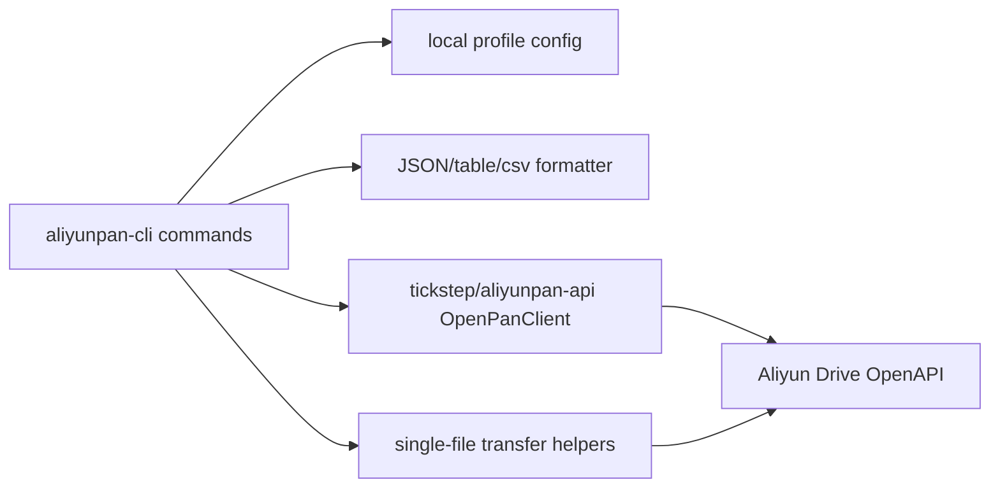

<div align="center">
  <h1>aliyunpan-cli</h1>
  <p><strong>Agent-friendly Alibaba Cloud Drive CLI for scripts, terminals, and automation.</strong></p>
  <p>
    A small Go CLI built on <code>tickstep/aliyunpan-api</code>, with JSON-first output and a clean OpenAPI-only MVP.
  </p>
  <p>
    <a href="https://github.com/Harzva/aliyunpan-cli">
      
    </a>
    <a href="./go.mod">
      
    </a>
    <a href="./LICENSE">
      
    </a>
    <a href="https://github.com/tickstep/aliyunpan-api">
      
    </a>
  </p>
  <p>
    <a href="#quick-start">Quick Start</a>
    ·
    <a href="#commands">Commands</a>
    ·
    <a href="#auth">Auth</a>
    ·
    <a href="#roadmap">Roadmap</a>
  </p>
</div>

```bash
$ aliyunpan-cli ls / --format table
contentHash  contentHashName  createdAt             driveId      fileId      name       parentFileId  path       size  type    updatedAt
-----------  ---------------  --------------------  -----------  ----------  ---------  ------------  ---------  ----  ------  --------------------
                                      ...            11519221     root        Backups                  /Backups   0     folder  ...
```

## Why This Exists

`tickstep/aliyunpan` is a mature interactive Aliyun Drive client. `aliyunpan-cli`
takes a narrower route: keep the Go SDK and transfer logic, then provide a
scriptable command surface that is predictable for automation and AI agents.

| Goal | What this MVP does |
| --- | --- |
| Script-friendly output | JSON by default, with `--format table` and `--format csv` for humans and pipelines |
| Clean transfers | Upload/download progress goes to stderr; stdout stays parseable |
| No public token broker dependency | `auth login` uses your own OpenAPI app credentials, and `auth import` can reuse an existing tickstep config |
| Small OpenAPI surface | First release focuses on files, drives, auth, and single-file transfers |

> This project intentionally does not implement WebAPI-only features yet. Sharing,
> albums, recycle-bin browsing, and advanced sync belong in phase two.

## Quick Start

Install from GitHub:

```bash
go install github.com/harzva/aliyunpan-cli@latest
```

Or build from a local checkout:

```bash
git clone https://github.com/Harzva/aliyunpan-cli.git
cd aliyunpan-cli
go build ./...
```

Import an existing `tickstep/aliyunpan` login:

```bash
aliyunpan-cli auth import --from ~/.config/aliyunpan/aliyunpan_config.json
aliyunpan-cli whoami
```

Then try the file commands:

```bash
aliyunpan-cli drive list --format table
aliyunpan-cli ls /
aliyunpan-cli stat /Documents/report.pdf
aliyunpan-cli mkdir /Backups
aliyunpan-cli upload ./report.pdf /Backups
aliyunpan-cli download /Backups/report.pdf --output ./report.pdf
```

## Commands

| Command | Purpose | Notes |
| --- | --- | --- |
| `auth login` | Login with your own Aliyun Drive OpenAPI OAuth app | Uses authorization code flow; no `api.tickstep.com` dependency |
| `auth import` | Import an existing `tickstep/aliyunpan` config | Reads `aliyunpan_config.json` and stores a local profile |
| `whoami` | Show current user and quota metadata | Fetches fresh OpenAPI user info |
| `drive list` | List available drives | Typically backup drive and resource drive |
| `drive use` | Set the active drive | Accepts drive id, `file`, or `resource` |
| `ls` | List a remote directory | Defaults to `/` |
| `stat` | Show one remote file or folder | Path must resolve in the selected drive |
| `mkdir` | Create a remote directory path | Creates intermediate folders through the SDK |
| `upload` | Upload one local file | Single-file transfer in the MVP |
| `download` | Download one remote file | Single-file transfer in the MVP |
| `rm` | Move remote paths to trash | Add `--permanent --yes` for permanent delete |

Common flags:

| Flag | Description |
| --- | --- |
| `--format json\|table\|csv` | Select stdout format. JSON is the default. |
| `--json` | Force JSON output and suppress progress. |
| `--no-progress` | Suppress transfer progress while keeping the selected output format. |
| `--config-dir PATH` | Use a custom config directory. |

## Auth

### Import From Tickstep

If you already use `tickstep/aliyunpan`, this is the fastest path:

```bash
aliyunpan-cli auth import \
  --from ~/.config/aliyunpan/aliyunpan_config.json \
  --profile default
```

The import command copies only the OpenAPI token and drive metadata needed by
this CLI. It does not depend on tickstep's public refresh service for the normal
command path.

### Login With Your Own OpenAPI App

Create or use your own Aliyun Drive OpenAPI OAuth application, then run:

```bash
aliyunpan-cli auth login \
  --client-id "$ALIYUNPAN_CLIENT_ID" \
  --client-secret "$ALIYUNPAN_CLIENT_SECRET"
```

The command prints an authorization URL and asks you to paste the returned code.
Defaults:

| Setting | Default |
| --- | --- |
| Authorize URL | `https://openapi.alipan.com/oauth/authorize` |
| Token endpoint | `https://openapi.alipan.com/oauth/access_token` |
| Redirect URI | `oob` |
| Scope | `user:base,file:all:read,file:all:write` |

You can override those values with `--authorize-url`, `--token-endpoint`,
`--redirect-uri`, and `--scope`.

## Output Contract

Automation should be able to trust stdout:

```bash
aliyunpan-cli ls / --json | jq '.[].name'
aliyunpan-cli upload ./archive.zip /Backups --no-progress > result.json
```

| Stream | Contents |
| --- | --- |
| stdout | JSON, table, or CSV command result |
| stderr | Human-readable errors, prompts, and transfer progress |
| exit code `0` | Success |
| exit code `2` | Usage error |
| exit code `3` | Auth/config error |
| exit code `4` | Aliyun Drive API error |
| exit code `5` | Local filesystem error |

## Configuration

By default, local config lives at:

```text
~/.config/aliyunpan-cli/config.json
```

Use another directory for CI or isolated profiles:

```bash
ALIYUNPAN_CLI_CONFIG_DIR=/path/to/config aliyunpan-cli whoami
aliyunpan-cli --config-dir ./tmp-config drive list
```

The config file can contain access and refresh tokens. Keep it out of Git and
store it with private file permissions.

## Architecture



## Current Limits

| Area | Current behavior |
| --- | --- |
| Upload | Single regular file only; directory recursion is planned |
| Download | Single remote file only; directory recursion is planned |
| Sync | Not included in the MVP |
| WebAPI | Share, album, recycle-bin browsing, and web-only flows are deferred |
| Refresh | OAuth refresh is supported for profiles with refresh tokens; imported tickstep profiles may need re-import or re-login after token expiry |

## Roadmap

| Phase | Scope | Status |
| --- | --- | --- |
| MVP | Auth import/login, drives, file listing, stat, mkdir, upload, download, rm | Done |
| Phase 1 | Directory upload/download, resumable transfer state, better progress summaries | Planned |
| Phase 2 | WebAPI-backed share, albums, recycle bin, and compatibility helpers | Planned |
| Phase 3 | Release binaries, shell completions, CI checks, packaged install paths | Planned |

## Development

```bash
go test ./...
go vet ./...
go build ./...
```

Repository layout:

| Path | Purpose |
| --- | --- |
| `main.go` | CLI entrypoint |
| `internal/app/app.go` | Command routing and common flags |
| `internal/app/auth.go` | OAuth login and tickstep config import |
| `internal/app/files.go` | Drive and remote file commands |
| `internal/app/transfer.go` | Single-file upload/download helpers |
| `internal/app/output.go` | JSON, table, and CSV output formatting |

## Safety Notes

- Do not commit `~/.config/aliyunpan-cli/config.json`.
- Do not paste tokens, cookies, exported configs, or `.env` values into issues.
- Prefer `auth login` with your own OpenAPI application for long-lived use.
- Treat imported tickstep configs as local convenience, not a public credential exchange.

## License

Apache-2.0. See [LICENSE](./LICENSE).
